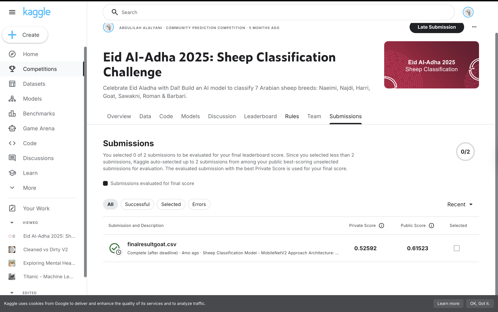

## Eid Al-Adha 2025: Sheep Classification (CNN, TensorFlow/Keras)

This folder contains my work for the **Eid Al-Adha 2025: Sheep Classification Challenge** on Kaggle (classifying 7 Arabian sheep breeds: Naeimi, Najdi, Harri, Goat, Sawakni, Roman, Barbari).

It was *not* my first image recognition project (I had already done MNIST and was working in parallel on a “Cleaned vs Dirty Plates” classifier), but it was one of my first **real-world, slightly messy vision problems**. This project is where I properly confronted **class imbalance, stronger data augmentation, Grad-CAM interpretability, and loss-function choices** in CNNs.

The notebooks are organised as a small timeline:

- `Tests 1.ipynb` – first working baseline with **ResNet50**, Adam, and categorical cross-entropy.  
- `Tests 2.ipynb` – introduce **class imbalance handling** (class weights, focal loss, simple upsampling) and the **first Grad-CAM visualisations** to see where ResNet50 is looking.  
- `Tests 3.ipynb` – further experiments on **imbalance + augmentation** with ResNet50 (tuning focal loss and stronger augmentations).  
- `Tests 4.ipynb` – switch to a lighter, more efficient **MobileNetV2** backbone with categorical cross-entropy and tuned augmentations.  
- `Tests 5.ipynb` – final MobileNetV2 training run and **Kaggle submission** generation (`finalresultgoat.csv`).

---

### Problem & dataset

- **Task:** multi-class classification of 7 sheep breeds from RGB photos.
- **Data:** labelled training images with breed names in a CSV, plus an unlabeled test set for Kaggle submissions.
- **Challenges:**
  - noticeable **class imbalance** (some breeds much rarer),
  - diverse backgrounds, poses, and lighting,
  - evaluation purely on **classification accuracy**, which can hide imbalance issues.

This made it a good playground for trying different ways of handling imbalance and for learning to look beyond just training accuracy.

---

### Model and training design

Across Tests 1–3 the main backbone was **ResNet50**, but the final pipeline moved to **MobileNetV2** in Tests 4–5:

- **Backbone (final):** `MobileNetV2` (`include_top=False`, ImageNet-pretrained) – chosen because it is lighter and easier to regularise on a relatively small dataset.
- **Head (final):**
  - `GlobalAveragePooling2D`
  - one or two `Dense` layers with ReLU
  - `Dropout` for regularisation
  - final `Dense(num_classes, softmax)` for breed probabilities

#### Two-phase training and loss choices

One of the key conceptual lessons in this project was how to combine **categorical cross-entropy (CE)** and **focal loss**:

- I found that **warming up the classifier head with standard CE** while the backbone is frozen gave a much smoother optimisation:
  - Phase 1: freeze the backbone, train only the new top layers with **categorical cross-entropy**.
  - Phase 2: unfreeze (all or part of) the backbone, lower the learning rate, and optionally switch to **focal loss** for better handling of hard, minority examples.
- Jumping directly into focal loss tended to make early training slower and less stable, especially with an imbalanced dataset and a large backbone like ResNet50.

#### Optimiser and hyperparameters

- Used **Adam** as the main optimiser.
- Learned how Adam’s adaptive learning rates and moving averages work (revisiting ISLR and other notes), and tuned:
  - base learning rate,
  - learning rate schedules,
  - weight decay / regularisation.

#### Imbalance handling

Across Tests 2 and 3 I explored several strategies:

- **Class weights** in the loss to up-weight rare breeds.
- **Focal loss** to put more emphasis on misclassified examples and under-represented classes.
- **Light upsampling** of minority classes (careful not to massively oversample very small classes and overfit them).
- Monitoring **macro metrics** (macro F1 / macro accuracy) rather than only overall accuracy.

#### Data augmentation

A progressively stronger augmentation pipeline was built:

- Random flips, small rotations, zoom/crop.
- Brightness and contrast perturbations.
- In some experiments, **CutMix-style** augmentation was explored (mixing patches of different images and combining labels), though this did not end up as part of the “final clean” pipeline.

---

### Grad-CAM and interpretability

This project is where I first applied **Grad-CAM** and became very interested in interpretability:

- For a given image and predicted class, Grad-CAM was used to compute a heatmap from the final convolutional feature maps, showing **where the model was focusing**.
- This allowed me to:
  - verify that the model often looked at the **sheep’s body/head** rather than the background,
  - spot failure modes where it relied on spurious context (background or shadows),
  - compare how attention changed between early ResNet50 models and the later MobileNetV2 models.

Seeing these explanations was one of the main reasons I became excited about **explainable AI for medical and real-world imaging tasks**.

---

### Theory and related ideas studied

While iterating through Tests 1–5, I also explored ideas that did not all make it into the final code but shaped how I think:

- Revisited chapters of **ISLR** to strengthen my understanding of:
  - overfitting vs regularisation,
  - cross-validation,
  - bias–variance tradeoff.
- Read about **margin-based softmax losses** such as **ArcFace**, which add an angular margin to better separate classes in feature space.
  - ArcFace itself was not plugged into this project, but it influenced the way I think about embedding quality and decision boundaries.
- Compared focal loss with standard CE and thought about when each is appropriate.

Whenever I was confused and asked ChatGPT for help, I added text cells in the notebook explaining **why a fix worked** or why a particular idea failed; this turned the notebooks into a learning log as well as code.

---

### Results (Kaggle)

The final pipeline in `Tests 5.ipynb` (MobileNetV2 + tuned augmentations + two-phase training) produced the submission:

- `finalresultgoat.csv`

Kaggle scores:

- **Public leaderboard score:** ≈ **0.61523**
- **Private leaderboard score:** ≈ **0.52592**

These scores are not state-of-the-art, but they are an honest reflection of where I decided to stop after a series of controlled experiments. By that point, I had:

- a **stable, crash-free training setup**,
- experience with **imbalance handling and loss choices**,
- a working **Grad-CAM visualisation toolchain**,
- and a clear sense of how to iterate further (e.g. better augmentations, more advanced loss functions, or different architectures).

---
