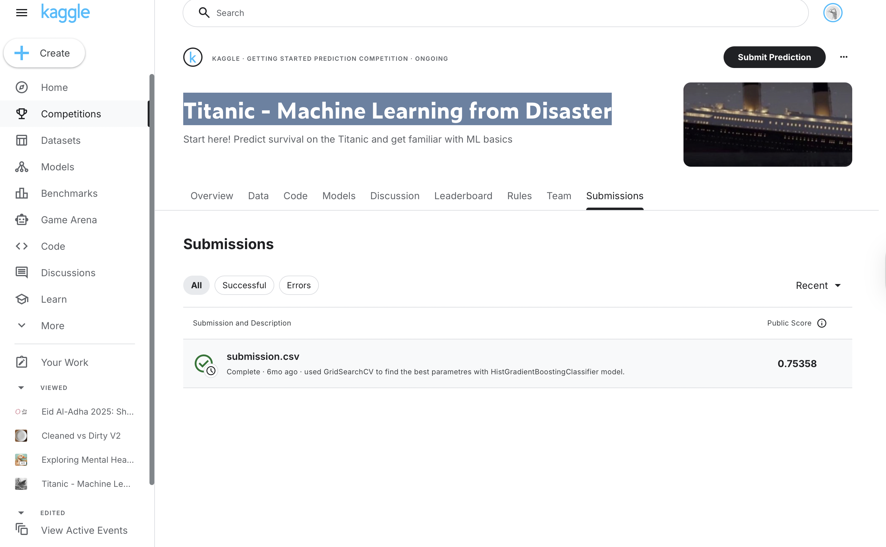

## Titanic – Machine Learning from Disaster (Logistic Regression & Gradient Boosting)

This folder contains my work for the classic Kaggle competition **“Titanic: Machine Learning from Disaster”**.  
I started this project after working through the example chapters in **An Introduction to Statistical Learning (ISLR)** and wanted a small, real dataset to practice:

- turning raw CSVs into clean feature matrices,
- fitting and interpreting **logistic regression**,
- comparing a linear model with a **non-linear tree-based method**, and
- generating a proper Kaggle submission.

The notebook in this folder is:

- `finaltitanic.ipynb` – full pipeline from raw data → cleaning → models → submission.

---

### Problem & data

- **Goal:** predict whether a passenger survived the Titanic disaster (`Survived` = 0/1).
- **Data:**
  - `train.csv` with labels (`Survived`) and passenger features.
  - `test.csv` without labels, used for Kaggle evaluation.
- **Features used:**
  - `Pclass`, `Sex`, `Age`, `SibSp`, `Parch`, `Fare`, `Embarked`
  - Some high-cardinality or messy variables were dropped: `Ticket`, `Name`, `Cabin`.

`PassengerId` is used as an index / identifier so it can be reused easily when building the submission.

---

### Data cleaning & feature engineering

The notebook walks through a very explicit, step-by-step cleaning process:

1. **Split target and features**

   - `train_y = train['Survived']`  
   - `train_x = train.drop('Survived', axis=1)`

2. **Drop unhelpful columns**

   - `Ticket`, `Name`, and `Cabin` are removed from both train and test.
   - This simplifies the feature space and avoids dealing with noisy high-cardinality strings.

3. **Handle missing values**

   - For the first models, I create `train_x_clean = train_x.dropna()` and align  
     `train_y_encoded = train_y.loc[train_x_clean.index]`.
   - This keeps only rows with complete data – simple, but very explicit.

4. **One-hot encoding**

   - Convert categorical variables to numeric using pandas `get_dummies`:
     - `Sex` → binary indicator.
     - `Embarked` → one-hot encoded (with `drop_first=True` to avoid collinearity).

5. **Apply the same transformations to the test set**

   - Drop `Ticket`, `Name`, `Cabin`.
   - One-hot encode `Sex` and `Embarked` in the same way as for the training data.
   - Align columns so train and test have the same feature set.

By the end, I have:

- `X` – clean numeric feature matrix from `train_x_clean`
- `y` – corresponding survived/not-survived labels
- `test` – cleaned features for the Kaggle test set

---

### Baseline: Logistic Regression

The first model is a **logistic regression**, directly reflecting ideas from ISLR:

- **Train/validation split**
  - `train_test_split(X, y, test_size=0.2, random_state=42)`
- **Model**
  - `LogisticRegression(max_iter=1000)` (increasing `max_iter` to avoid convergence warnings).
- **Evaluation**
  - Validation accuracy.
  - `classification_report` (precision, recall, F1 for each class).
  - `confusion_matrix` to see which types of passengers the model gets wrong.

This baseline let me:

- see how logistic regression behaves on a real, slightly messy dataset,
- inspect **coefficients** (via a small DataFrame) to understand which features push survival probability up or down,
- connect these findings directly to the logistic regression chapter in ISLR.

---

### Final model: HistGradientBoostingClassifier + Grid Search

After the linear baseline, I moved to a stronger non-linear model that can capture interactions:

- **Model:** `HistGradientBoostingClassifier` from `sklearn.ensemble`
- **Hyperparameter search:** `GridSearchCV` over a small grid, for example:
  - `learning_rate` ∈ {0.01, 0.05, 0.1}
  - `max_depth` ∈ {3, 5, 7}
  - `max_iter` ∈ {100, 200, 500}

The workflow:

1. Fit `GridSearchCV` on the cleaned training data (`X`, `y`).
2. Inspect `best_params_` and choose the best configuration.
3. Build `final_model = HistGradientBoostingClassifier(**best_params, random_state=42)`.
4. Retrain `final_model` on **all available training data**.
5. Predict on the cleaned `test` set to obtain survival predictions for every passenger.
6. Combine `PassengerId` and predictions into `submission.csv` and upload to Kaggle.

The important part is that the whole pipeline is **reproducible**: from raw CSV → cleaned features → baseline → tuned gradient boosting → submission file.

---

### Results (Kaggle)

The final `HistGradientBoostingClassifier` model (with hyperparameters chosen by `GridSearchCV`) achieved:

- **Public leaderboard score:** **0.75358**

This score comes from the `submission.csv` generated in `finaltitanic.ipynb` and submitted to the Kaggle “Titanic – Machine Learning from Disaster” competition.

It is not a top-leaderboard solution, but it is a solid result for a **first principled pipeline**: a carefully cleaned feature set, an interpretable logistic regression baseline, and then a tuned gradient-boosted model that clearly improves on the baseline. For my purposes, the value of this project was less about squeezing out a few extra leaderboard points and more about proving that I can:

- turn a raw tabular dataset into a clean feature matrix,
- compare linear and non-linear models in a disciplined way, and
- carry the whole process through to a valid Kaggle submission with a competitive mid-table score.

